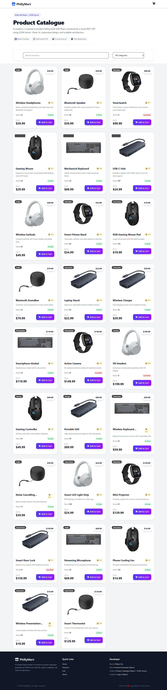
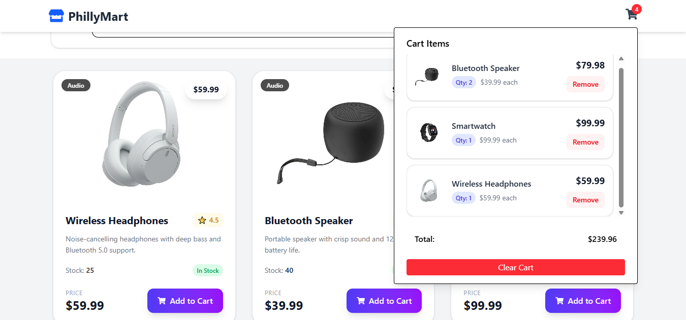

# PhillyMart: E-commerce Shopping Cart UI

PhillyMart is a React e-commerce catalogue and shopping cart interface. It demonstrates how a product listing can be split into reusable components, how shared state can be managed with React Context, and how a frontend can consume a local mock REST API provided by JSON Server.

The application includes:

- A responsive product catalogue with 26 sample products
- Product cards with images, descriptions, prices, ratings, categories, and stock status
- Case-insensitive product-name search
- Category filtering generated from the loaded product data
- Add-to-cart behavior with quantity accumulation
- A cart dropdown showing line totals and the overall cart total
- Remove-item and clear-cart actions
- Cart persistence through browser `localStorage`
- Loading, request-error, and empty-search-result states

## Screenshots

### Product catalogue



### Cart dropdown



## Technology Stack

- **React 19** for the component-based user interface
- **React DOM** for mounting the application in the browser
- **Vite** for development, bundling, and the development-server proxy
- **Tailwind CSS 4** through the Tailwind Vite plugin for styling
- **React Icons** for the store and shopping-cart icons
- **JSON Server** as a local mock REST API
- **ESLint** with React Hooks and React Refresh rules for static checks

## Requirements

Install the following before starting the project:

- Node.js and npm
- A modern web browser

Confirm that they are available:

```bash
node --version
npm --version
```

## Installation

Clone or open the project, then install its dependencies:

```bash
npm install
```

## Running the Application

The application expects two local processes: the Vite frontend and the JSON Server API.

Open one terminal and start the API:

```bash
npm run json-server
```

This starts JSON Server on `http://localhost:5000` and exposes the products resource at:

```text
http://localhost:5000/products
```

Open a second terminal and start the frontend:

```bash
npm run dev
```

Open the URL printed by Vite, normally `http://localhost:5173`.

### Why both processes are needed

`ProductContext` fetches products from `/api/products`. The Vite configuration proxies `/api` requests to `http://localhost:5000` and removes the `/api` prefix. Therefore:

```text
Browser request:  /api/products
Proxy forwards:   http://localhost:5000/products
```

If JSON Server is not running, the catalogue displays the product-fetch error state.

## Available Scripts

| Script | Purpose |
| --- | --- |
| `npm run dev` | Start the Vite development server |
| `npm run build` | Create a production build in `dist/` |
| `npm run preview` | Preview the production build locally |
| `npm run lint` | Run ESLint across the project |
| `npm run json-server` | Start JSON Server on port 5000 |

## Project Structure

```text
.
├── index.html                 # HTML entry point and root element
├── package.json               # Dependencies and npm scripts
├── vite.config.js             # Vite, Tailwind, and API proxy configuration
├── eslint.config.js           # ESLint configuration
├── public/
│   ├── images/                # Product images served from /images
│   └── screenshots/           # README screenshots
└── src/
		├── main.jsx               # React bootstrap and provider composition
		├── App.jsx                # Main page composition
		├── index.css              # Tailwind CSS entry point
		├── components/
		│   ├── Header.jsx         # Branding and cart dropdown
		│   ├── SubHeader.jsx      # Catalogue introduction and controls layout
		│   ├── SearchBar.jsx      # Search input
		│   ├── CategoryFilter.jsx # Category select input
		│   ├── Product-list.jsx   # Fetch-state handling and filtering
		│   ├── Product-card.jsx   # Individual product presentation
		│   └── Footer.jsx         # Footer and project information
		├── context/
		│   ├── ProductContext.jsx       # Product fetching state
		│   ├── ProductFilterContext.jsx # Search and category state
		│   └── CartContext.jsx          # Cart state and persistence
		└── data/
				└── db.json            # JSON Server database and product records
```

## Application Architecture

### Entry point and provider order

`src/main.jsx` renders the application inside `StrictMode` and three context providers:

1. `ProductProvider` loads products and supplies `products`, `loading`, and `error`.
2. `CartProvider` supplies the cart and cart actions.
3. `ProductFilterProvider` supplies `searchTerm`, `category`, and their setters.

This keeps shared state above the components that consume it. `App.jsx` then composes the page from `Header`, `ProductList`, and `Footer`.

### Product data flow

When `ProductProvider` mounts, its `useEffect` calls `fetch('/api/products')`. A successful response is parsed as JSON and stored in the `products` state. The `finally` block ends the loading state whether the request succeeds or fails.

`ProductList` consumes that state and renders one of three outcomes:

- A loading message while the request is pending
- An error message when the request fails
- The filtered product grid after the request completes

### Search and category filtering

`SearchBar` writes the input value to `ProductFilterContext`. `CategoryFilter` builds its options by taking the unique `category` values from the loaded products. `ProductList` applies both filters together:

- Search compares the lower-case search term with the lower-case product name.
- An empty category means all categories are accepted.
- A product is shown only when it satisfies both conditions.

Filtering is derived during rendering; the project does not maintain a second, duplicated filtered-products state.

### Cart data flow

`CartContext` initializes its state from the browser's `localStorage` key named `cart`. A `useEffect` serializes the latest cart back to that key whenever the cart changes.

The `AddToCart` action checks whether the product already exists:

- Existing item: create a new cart array with its `qty` increased by one.
- New item: append a copy of the product with `qty: 1`.

The header derives two display values from the cart:

- `itemCount`: the sum of every item's quantity
- `total`: the sum of `price * qty` for every line item, formatted to two decimal places

The dropdown also exposes `removeFromCart(id)` and `clearCart()` actions. Cart state is local to the browser and is not sent to the API.

## Data Model

Each product in `src/data/db.json` follows this shape:

```json
{
	"id": 1,
	"name": "Wireless Headphones",
	"description": "Noise-cancelling headphones with deep bass and Bluetooth 5.0 support.",
	"price": 59.99,
	"quantity": 25,
	"category": "Audio",
	"rating": 4.5,
	"image": "images/product-1.png"
}
```

The `quantity` field is used for catalogue stock messaging. It is not decremented when an item is added to the cart, so this project models cart interaction rather than a complete inventory or checkout system.

The image path is relative to the public directory. For example, `images/product-1.png` is available in the browser as `/images/product-1.png`.

## UI Behavior

- Product cards use a three-column layout on large screens and reduce to two or one column at smaller widths.
- Products with a quantity below 20 display **Low Stock**; all other products display **In Stock**.
- The cart icon shows a red badge only when the cart contains at least one item.
- The cart dropdown is toggled by clicking the cart icon.
- Product names and descriptions are visually clamped to preserve consistent card sizing.
- Hover states add elevation, image scaling, and button feedback.
- If no product matches the active filters, the grid displays a helpful empty state.

## Learning Guide

This project is useful for studying the following React concepts:

1. **Component composition:** a page is assembled from focused components instead of one large component.
2. **Context and custom hooks:** `useProducts`, `useProductFilter`, and `useCart` hide provider details from consumers.
3. **Controlled inputs:** search and category controls receive their values from context and update through setter functions.
4. **Derived state:** filtered products, item counts, and totals are calculated from source state.
5. **Immutable updates:** cart operations use array methods and object spreads to produce new state values.
6. **Side effects:** product fetching and `localStorage` synchronization are handled with `useEffect`.
7. **Async UI states:** the product list accounts for loading, error, empty, and successful states.
8. **Development proxying:** Vite makes the browser-facing `/api` path independent of the JSON Server host URL.

## Current Scope and Limitations

This is a frontend catalogue demonstration, not a production commerce backend. In particular:

- There is no authentication, checkout, payment, or order submission.
- Cart contents are stored only in the current browser's `localStorage`.
- JSON Server provides mock data and does not represent a production database.
- Adding to the cart does not validate or reduce available stock.
- The footer links are presentational text rather than routed pages.
- Product images are reused for some sample records because the dataset is designed for demonstration.

## Possible Extensions

Natural next steps for study or further development include:

- Add quantity increment and decrement controls inside the cart.
- Prevent cart quantity from exceeding available stock.
- Add sorting by price, rating, or stock.
- Add product detail pages and client-side routing.
- Add automated tests for contexts, filters, and cart totals.
- Replace JSON Server with a real API and persistent database.
- Add checkout validation and an order confirmation flow.
- Improve accessibility with explicit labels, focus management, and keyboard interaction for the cart menu.

